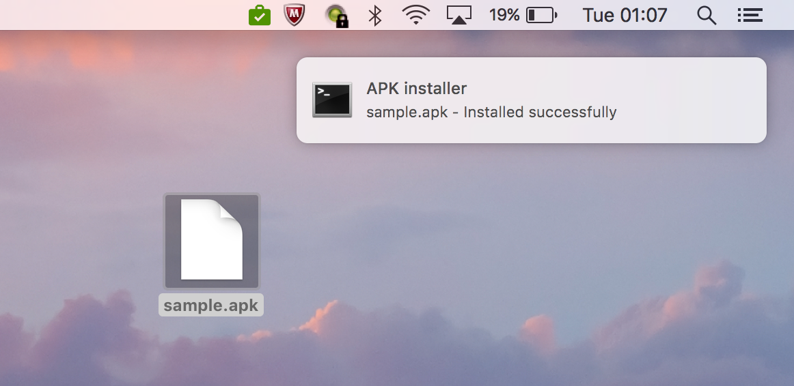
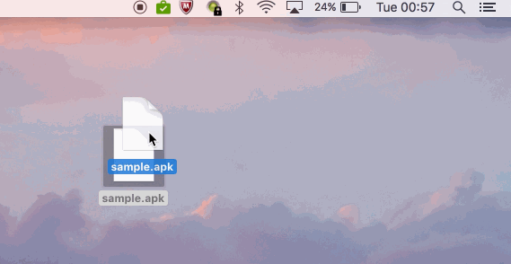

# Tray APK installer
> Fastest way to install APKs

<p align="center">

</p>

[](https://travis-ci.org/cesarferreira/tray-apk-install)
[](https://www.npmjs.com/package/tray-apk-install)
[](https://www.npmjs.com/package/tray-apk-install)

## Install

```
$ npm install -g tray-apk-install
```

## Usage

Drag any `apk` file to the icon in the tray.

<p align="center">

</p>


## Created by
[Cesar Ferreira](https://cesarferreira.com)

## License
YOLO © [Cesar Ferreira](https://cesarferreira.com)